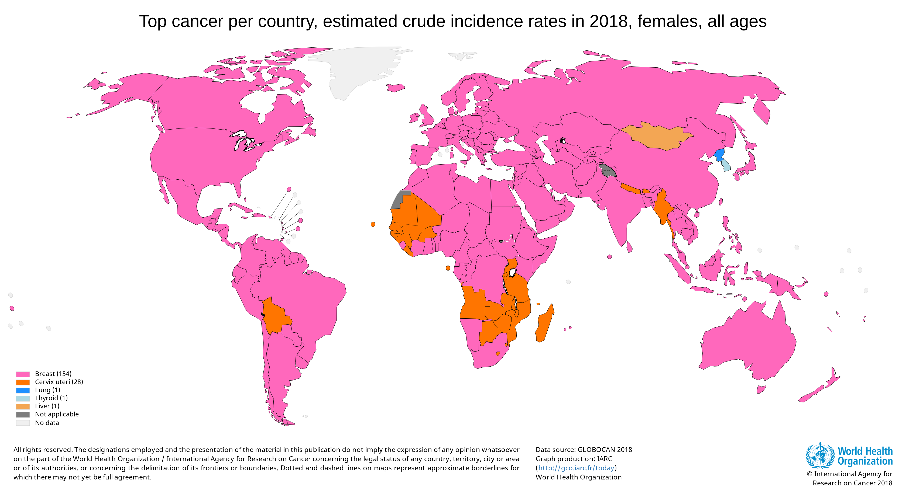
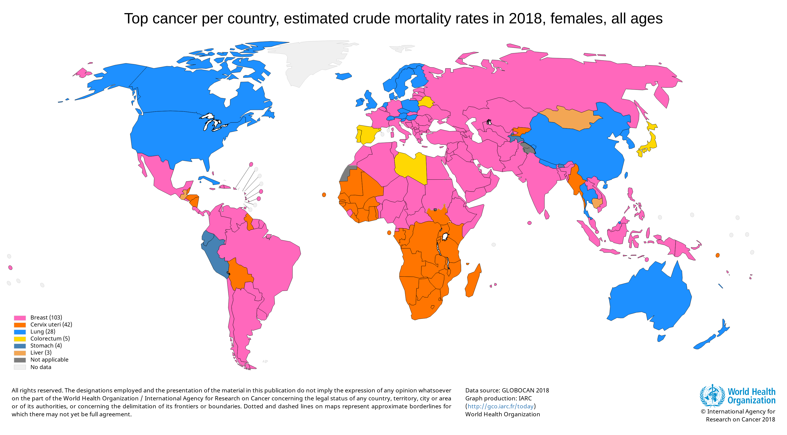

---
output:
  bookdown::pdf_document2:
    template: templates/brief_template.tex
  bookdown::word_document2: default
  bookdown::html_document2: default
documentclass: book
#bibliography: references.bib
---

```{r setup, include = FALSE}
library("papaja")
library("ggplot2")
library("readr")
library("tidyverse")
library("knitr")
```

# Introduction {-}

\adjustmtc 

## Background
Cancer is the one of the world’s leading health problems, with one in five men and one in six women developing the disease, and one in eight men and one in eleven women losing their life to it (GLOBOCAN). Cancer occurs due to the continual upregulated proliferation of cancer cells, which grow and divide at an uncontrolled rate, rather than responding to signals that control cellular behaviour (Feitelson et al., 2015; Hanahan & Weinberg, 2011). The abnormal proliferation of cells (tumour) can occur in a variety of cells within the body and there are therefore hundreds of distinct types of cancer, all of which behave and respond to treatment differently. A tumour may be benign, in which the cells remain confined to their original location, or malignant whereby cells invade surrounding tissues and are able to spread throughout the body (metastasis). The confinement of benign tumours makes surgical intervention possible, whereas the spread of malignant cells often makes them resistant to such localised treatment. 
The original hallmarks of cancer describe six processes that lead to the development and progression of cancer, self-sufficiency in growth signals, insensitivity to anti-growth signals, evading apoptosis, limitless replicative potential, sustained angiogenesis, and tissue invasion and metastasis (Hanahan & Weinberg, 2000). Since, technological advancements have led to a superior understanding of cancer hallmarks and inflammation, genomic instability and mutation, deregulation of cellular energetics and avoidance of immune destruction were recognised as ‘emerging’ cancer hallmarks (Figure 1) (Hanahan & Weinberg, 2011).

```{r hallmark-figure, echo = FALSE, out.width= "80%", fig.cap= "Ten Hallmarks of Cancer", fig.align='center'}
knitr::include_graphics("figures/hallmarks.jpg")
```

## Cancer Development and Progression

### Hallmark One: Replicative Immortality

A ‘normal’ cell in the body is limited by the number of successive cell cycles it can go through, known as the Hayflick limit (Hayflick, 1965; Hayflick & Moorhead, 1961). This is due, in part, to the shortening of specialised chromatin structures at the end of chromosomes (telomeres) after each mitotic division, which protect against the end to end chromosome fusions that threaten cell viability. Each replication typically loses 50 to 100 nucleotides of DNA telomere. Once the telomere shortens beyond a specific limit, usually the ‘uncapping’ of telomere ends, it triggers the p53 pathway, preventing further proliferation. Though, the reasons for this progressive shortening is unclear (Reddel, 2000). In addition, oncogenic and mitogenic signals also induce senescence, establishing a barrier against tumorigenesis. 

Telomere length is an important factor in the development and progression of many human diseases, specifically those associated with age, where there is increased telomere degradation (Blasco, 2005). It is generally accepted that cancer cells have unlimited replicative potential and are able to overcome senescence and subsequent cell death (Hanahan & Weinberg, 2011; Reddel, 2000). An array of evidence suggests that cancer cells are able to elongate their chromosome telomeres through specialised DNA polymerase (telomerase) that adds repeated segments to the telomere (Blasco, 2005; Bodnar et al., 1998; Dimri, 2005; Hanahan & Weinberg, 2011). Kim and colleagues (1994) reported more than 90% of tumours contained increased telomerase activity (Kim et al., 1994). 
Although, it has since been discovered that not all cancers have an active telomerase, which lead researchers to explore alternative explanations for the increased lengthening of telomeres. One suggestion has been that it may be possible for tumour formation to occur, without the presence telomerase, if the telomere has a sufficient reservoir of telomere repeats before it reaches the ‘limit’ triggering the DNA damage response (Dagg et al., 2017; Viceconte et al., 2017). The development of cancer is a complex process and the abrogation of senescence alone does not lead to tumour development.

### Hallmark Two: Genome Instability
<<<<<<< HEAD
Replicative immortality and many of the other cancer hallmarks depend on the successive adaptation of the tumour genome. Yet, genomes are highly refined to detect and resolve defects in the DNA to limit spontaneous mutation. Cancer cells are able to increase the rate of mutation and perform tumourigenesis by heightening mutogenic sensitivity and causing breakdown of the genomic maintenance machinery (Hanahan & Weinberg, 2011; Negrini, Gorgoulis, & Halazonetis, 2010). An array of genomic maintenance defects have been reported in the literature and can be categorised by whether they impact the detection of DNA damage, the repair of damaged DNA, or prevent DNA damage by intercepting mutogenic molecules (Ciccia & Elledge, 2010; Hanahan & Weinberg, 2011; Jackson & Bartek, 2009; Negrini et al., 2010).

The inactivation of genomic maintenance machinery leads to genomic instability, of which the main form is chromosomal instability (CIN); the increased rate of chromosome structure change compared to with normal cells (Negrini et al., 2010). Two hypotheses have been offered to explain genomic instability, the first relates to mutation and the second to oncogene-induced DNA replication. In hereditary cancers, it appears that genomic instability is a consequence of DNA repair gene mutation, however, sequencing studies in non-hereditary cancers have failed to detect mutations and there remains a degree of uncertainty in this hypothesis (Negrini et al., 2010). Alternatively, patterns in tumour suppressor genes (TP53/p53, ATM and CDKN2A/p16INK4A and P14ARF) and oncogenes (EGFR and RAS) support the oncogene-induced DNA replication hypothesis. However, the accumulation of cells is only possible if cells can avoid being detected by the surveillance system and subsequent senescence or apoptosis, which is discussed later in this chapter (Jackson & Bartek, 2009). 

=======
insert text here
>>>>>>> ac9ab22036a8180f2e0b34735f10cba8cdf705b8

### Hallmark Three: Evasion of Growth Suppressor Signals

Tumour suppressor genes contribute to the fidelity of the cell cycle replication process by limiting cell growth, inhibiting cell transformation and preventing proliferation (Hanahan & Weinberg, 2011). The genes are responsible for regulating the cell cycle, apoptosis, differentiation, signal transduction and cellular adhesion, genomic instability surveillance and DNA repair. Tumour suppressor genes are commonly lost or deleted in cancer patients, allowing cells to replicate and grow. p53 or TP53 and retinoblastoma associated (Rb) proteins govern the decisions of a cell to proliferate, or activate apoptosis, and are the most commonly mutated genes in cancer patients. The mechanisms by which tumour suppressor genes are inactivated depends on the gene involved and therefore vary tumour to tumour, for instance the mutation BRCA1 and BRCA2 predisposes women to breast and ovarian cancers (Deng & Scott, 2000).  

p53 (TP53), Rb1, BRCA1 and BRCA2 are all examples of intragenic mutations which are able to down regulate tumour suppressor function by inappropriate expression of transcriptional activators and the promotion of methylation, repressing tumour suppressors. Conceptually, tumour suppressor genes can be classified into two categories; gatekeepers and caretakers (Oliveira, Ross, & Fletcher, 2005; Zhou, Zhang, Liu, Yang, & He, 2011). Caretaker tumour suppressors are genes whose loss of function is not directly associated with tumour development. Whereas, gatekeeper tumour suppressor genes (p53, Rb) directly inhibit tumour growth and promote cell death, therefore, inactivity of these genes facilitates cancer formation and proliferation.
The retinoblastoma (Rb) protein determines whether a cell should proceed to grow and divide, or not. The gene plays a vital role in cell cycle checkpoint control, whereby active Rb1 binds to transcription factor E2F and renders it inactive. Retinoblastoma (Rb) proteins largely function extracellularly, whereas, TP53 (p53) operates within the cell (intracellularly) to detect signals of stress or abnormality and is deleted or mutated in 50% of all cancers (Oliveira et al., 2005). When the gene detects abnormal genome damage or excessive nucleotide pools, growth promoting signal, glucose or  suboptimal oxygenation TP53 (p53) ceases further cell-cycle progression or initiates apoptosis (Hanahan & Weinberg, 2011). Therefore, any down regulation of these gene pathways makes cell proliferation and tumour growth possible.

TP53 mutation is more common in BRCA1 and BRCA2 breast cancer though the prevalence of TP53 mutation is lower in breast cancer generally than many other cancers and is typically associated with more aggressive conditions (Taylor & Stark, 2001). Though there appears to be some inconsistency in the literature with regard to the relationship between Rb1 and TP53 tumour suppressor expression and breast cancer prognosis (Oliveira et al., 2005). 

### Hallmark Four: Resistance to cell death

Apoptosis (programmed cell death) serves as a natural barrier to cancer development and progression and plays an essential role in development, immunity and disease where removal of superfluous cells promotes organismal health (Adams & Cory, 2007; Lowe, Cepero, & Evan, 2004).  Cancer cells evade apoptosis due to signalling imbalances that result in elevated levels of oncogene. Apoptosis is governed by both upstream regulators and downstream effectors. Regulators are either extracellular death inducing signals (FAS ligand/FAS receptor) which form the extracellular apoptotic program, or intracellular sensors which form the intracellular apoptotic program (Hanahan & Weinberg, 2011). The cells decision to undergo apoptosis is largely determined by intracellular cysteine proteases and is primarily regulated by the BCL-2 protein family that respond to DNA damage, gamma irradiation, oncogene activation and the withdrawal of growth factor (Adams & Cory, 2007). BCL-2 proteins BCL-XL, MCL-1 and BFL1 are pro-survival proteins that regulate protein turnover that respond to cell death stimuli (Campbell & Tait, 2018), it is therefore of no surprise that there is increased expression of these proteins in many cancer types. The upregulation of pro-survival BCL-2 proteins can occur through chromosomal translocation, gene amplification and increased gene expression and consequently increasing cell death resistance. Whereas, BCL-2 proteins BIM, BAD, BID, NOXA, PUMA, BMF, HRK and BIK are pro-apoptotic. Pro-apoptotic BCL-2 proteins in normal cells respond to stress to trigger cell death. Studies have revealed that effector proteins BAC, BAK and BOK conform to similar pro-survival BCL-2 proteins (Suzuki, Youle, & Tjandra, 2000). However, similarly to the effects of upregulating pro-survival proteins, the downregulation of pro-apoptotic proteins can lead to cell death resistance. 

Although, the cellular conditions that trigger apoptosis are yet to be fully determined, several abnormalities can be identified in the role of tumour development. Primarily tumour cells are able to circumvent apoptosis by hindering the TP53 tumour suppressor responsible for regulating NOXA and PUMA in the presence of DNA damage. Additionally, tumours may increase the expression of pro-survival proteins or decrease the expression of pro-apoptotic proteins, as previously discussed. 

### Hallmark Five: Sustained Proliferation

Normal tissues are able to tightly control and regulate the production and release of growth promoting signals, in order to maintain tissue homeostasis. On the other hand, cancer cells possess the ability to downregulate these signals enabling the cell to proliferate due to replicative immortality, genomic instability, evasion of growth suppressor signals and their resistance to cell death previously discussed. The mitogenic signalling in cancer cells is better understood than the proliferative signals functioning within normal tissue and can occur in a variety of ways (Lemmon & Schlessinger, 2010; Witsch, Sela, & Yarden, 2010). The cell may produce growth factor ligands and stimulate autocrine proliferation, resulting in transactivation of epidermal growth factor receptor (EGFR) and other pathways that contribute to the proliferation of tumour cells. Cancer cells also have the capacity to stimulate normal tissue cells within the stroma/microenvironment (extracellular matrix (ECM)), which in turn promotes cancer cell growth factors, giving rise to a vicious cycle. In addition receptor proteins on the cancer cell surface can be elevated, enhancing their responsiveness to ligand growth factor and downregulating receptor cell signalling (Hanahan & Weinberg, 2011). 

Furthermore, cancer cell proliferation is increased in the presence of oncogene mutation. Mutations in either the upstream of downstream Ras signalling pathways are associated with cancer progression and it appears that the deregulation of Ras signalling is essential for tumourgenesis (Fernández-Medarde & Santos, 2011). Although, Ras mutations (H-Ras, N-Ras or K-Ras) are less common in high incidence cancers such as breast, prostate and liver, high levels of H-Ras in breast cancer indicate a worse prognosis (Watson et al., 1991). 

### Hallmark Six: Altered Metabolism

insert text here

### Hallmark Seven: Avoiding Immune Destruction

insert text here

### Hallmark Eight: Tumour Promoting Inflammation

insert text here

### Hallmark Nine: Induction of Angiogenesis

Tumour cells, like any cell, require nutrients and oxygen to survive. To meet the demand for nutrients, oxygen and immune cells, and in order to remove waste products that are associated with cancer metabolism, the tumour develops its own vascular network, this process is referred to as angiogenesis. The process of angiogenesis is triggered by the increased nutrient and oxygen requirements of tumour tissue and occurs in stages. Initially, the basement membrane becomes injured and hypoxic. In response, angiogenic factors activate endothelial cells which assemble into tubes (vasculogenesis) and begin to sprout new vessels from the existing ones. Though, the up regulation of angiogenic factors alone is not enough for angiogenesis of the neoplasm, there must also be simultaneous down regulation of inhibitors (Nishida, Yano, Nishida, Kamura, & Kojiro, 2006). Angiogenic factors continue to influence the angiogenic process, leading to normal vasculature dormancy. In normal cells angiogenesis is required for tissue repair but is capable of “switching off”, where in cancer cells it remains “on” (Hanahan & Folkman, 1996). 

The up regulation of vascular endothelial growth factor-A (VEGF-A) has been well-established as an angiogenesis inducer, other proteins capable of inducing angiogenesis include basic fibroblast growth factor (bFGF), transforming growth factor (TGF) alpha and beta, tumour necrosis factor (TNF)-alpha, interleukin-8, epidermal growth factors among others. Ligands encoded by VEGF-A genes are partially responsible for the development of new blood and over expression of VEGF can be caused by both hypoxia and oncogene signalling (Ferrara, 2009; Gabhann & Popel, 2008). Hypoxia occurs due to the growing distance between tumour cells and capillaries. In response, the tumour cells secrete VEGF into the surrounding tissue activating endothelial cells to produce metalloproteinases (MMPs), which break down the extracellular matrix and fills the void between cells (Nelson, Fingleton, Rothenberg, & Matrisian, 2000; Nishida et al., 2006). After endothelial cells divide and migrate, they form tubes that, with the help of integrin alpha and beta, mature into new blood vessels (Nelson et al., 2000). A number of studies have reported a strong correlation between VEGF expression and cancer prognosis (Nishida et al., 2006), with the following studies demonstrating this in breast cancer (Kinoshita et al., 2001; Kurebayashi et al., 1999; Skobe et al., 2001).  In addition to increased VEGF expression, upregulated proangiogenic signals, such as fibroblast growth factor, sustain angiogenesis (Baeriswyl & Christofori, 2009). 

As previously discussed, the upregulation of VEGF and other proangiogenic signals is not enough to maintain angiogenesis, there must be simultaneous down regulation of angiogenesis inhibitors. Thrombospondin-1 (TSP-1), an angiogenesis inhibitor, is down regulated when it binds to transmembrane receptors displayed by the endothelial cells (Hanahan & Weinberg, 2011). Downregulation of other inhibitors may include angiostatin, endostatin, interferon, platelet factor 4, prolactin 16 kd fragment, and tissue inhibitor of metalloproteinase-1, -2, and -3 (Nishida et al., 2006).

### Hallmark Ten: Activation of Invasion and Metastasis 

A series of successive cellular changes, often termed the invasion-metastasis cascade, leads to the invasion and metastasis of cancer cells. The multistep process can be broken down into the following steps: invasion, intravasation, surviving systematic circulation and extravasation. Epithelial-mesenchymal transition (EMT) has been identified as a regulatory program that possesses the ability to invade, resist apoptosis and disseminate transformed epithelial cells (Klymkowsky & Savagner, 2009; Polyak & Weinberg, 2009; Thiery, Acloque, Huang, & Nieto, 2009; Yilmaz & Christofori, 2009). Intracellular signalling pathways (TGF-beta, growth factors that bind with RTK and WNT ligands) are triggered when ligands bind to transmembrane receptors. These signals are expressed in the tumour microenvironment, where tumour cells undergo EMT (Ye & Weinberg, 2015). Genetic variation may also contribute to tumour cell EMT as evidenced by Neve and colleagues (2006) who found mesenchymal features in the absence of extrinsic signalling (Neve et al., 2006). In both instances activating EMT transcription factors that repress epithelial cell to cell adhesion whilst simultaneously promoting mesenchymal factors that alter cytoskeleton, protrusion formation and cell migration (Pearson, 2019).

The suppression of cell to cell adhesion protein E-cadherin, which has both invasive traits and metastatic properties, is the most established mechanism associated with cell migration (Pearson, 2019; Zaidel-Bar & Geiger, 2010). The reduced E-cadherin in transformed epithelial cells is enough to induce EMT, invasion and metastasis, however, the loss alone is not substantial enough to promote EMT in all circumstances (Khalil et al., 2017; Onder et al., 2008). EMT transcription factors (EMT-TF) also induce mesenchymal genes that are capable of altering cell morphology, migration and ECM remodelling (Thiery et al., 2009). Changes in cell morphology allow EMT cells through the ECM via existing tracks created by non-tumour populations in the microenvironment (Yamaguchi, Wyckoff, & Condeelis, 2005), the EMT program itself allows tumour cells to remodel the ECM, facilitating initial invasion from ductal structures, migration and intravasation into blood vessels (Pearson, 2019).

The signalling that occurs between cancer cells and connective tissue cells of the organ (stroma) are capable of stimulating invasive behaviours. Mesenchymal stem cells (MSCs) in the tumour stroma release CCL5/RANTES in response to these signals, which has been found to encourage changes in the phenotype of cancer cells and lead to metastatic spread (Karnoub et al., 2007). Matrix degrading enzymes, found in the periphery of the tumour can further facilitate invasion (Hanahan & Weinberg, 2011). In metastatic breast cancer, epidermal growth factor (EGF) is supplied to the breast cancer cells by tumour-associated macrophages (TAMs), in response cancer cells syntheses CF-1 which stimulates macrophage production and the subsequent intravasation and dissemination of cancer cells (Qian & Pollard, 2010; Wyckoff et al., 2007). Macrophages also secrete protein, rich in cysteine (SPARC/osteonectin), that promote invasion and adhesion to other components of the ECM, and are required for spontaneous metastasis (Sangaletti et al., 2008). This colocalization of macrophages, tumour cells, and endothelial cells (tumour microenvironment of metastasis (TMEM)), has been shown to be a prognostic marker for poor survival in breast cancer (Robinson et al., 2009).

Metastasis occurs in two distinct phases; the physical dissemination of cells from a local region to distant tissue and the adaptation of cells to foreign microenvironments, that results in successful colonization. Colonization is a process of great complexity and while in some cancers the suppressor factors released by the tumour render metastases dormant until resection (Demicheli, Retsky, Hrushesky, Baum, & Gukas, 2008), in others, such as breast cancer, metastases may develop decades after initial treatment (surgical or pharmacological treatment) (Barkan, Green, & Chambers, 2010).

## Epidemiology

Population growth and age distribution are factors associated with the rapidly increasing cancer incidence and mortality worldwide, as well as changes in the prevalence of risk factors, many of which are associated with socioeconomic development. The Global Cancer Observatory estimated the worldwide population in 2018 to be more than 7.5 billion, of which over 43.5 million people were affected by cancer (5-year prevalence), 18 million new cases of cancer were reported, and more than 9.5 million deaths occurred. The most common cancers are lung, breast, colorectal and prostate, cumulatively these account for over half of new cancers (42.7%) (Bray et al., 2018). The majority of new cancer cases were in men (52%), where lung cancer was the most commonly occurring (15.5%), followed closely by prostate (14.5%) and colorectal (11.4%) cancers.

Forty-eight percent of new cancer cases in 2018 were in in women, with the most common cancer being breast cancer, which accounted for 25.4% of all cancer cases and was over twice as common as its closest rivals; colorectal (9.7%) and lung cancer (8.8%) (Bray et al., 2018).

Approximately two million cases of breast cancer are diagnosed every year, the equivalent of one new case every 16 seconds. Breast cancer is the most frequently diagnoses cancer in women across all continents, ranking highest in 154 of 185 countries, despite differences in per capita income (Bray et al., 2018). Incidence rates vary depending on regional income, with higher income countries experiencing more breast cancer cases.

```{r Global Cancer Incidence, echo = FALSE, out.width= "80%", fig.cap= "Top Cancer per Country, Estimated Crude Incidence Rates in 2018, Females, All Ages", fig.align='center'}

```


Having increased year on year, the European incidence rate reached 136.0 per 100,000 in 2018, with over five hundred newly diagnosed cases, an incidence rate five times greater than that of breast cancer incidence in Africa (26.2 per 100,000), three times greater than Asia (41.1 per 100,000) and double Latin America and the Caribbean (60.6 per 100,000). The only continent to experience greater incidence rates was North America, where the incidence rate is marginally bigger at 142.8 per 100,000. 
The highest incidence rates are seen in Belgium (203.7 per 100,000), The Netherlands (188.9 per 100,000), Italy (187.8 per 100,000), Luxembourg (175.4 per 100,000) and Germany (172.2 per 100,000). The United Kingdom registered 55,439 new breast cancer cases in 2018 and ranked ninth globally with an incidence rate 164.5 per 100,000. The lowest reported incidence is in Bhutan with 16 new cases and an incidence rate of 4.2 per 100,000, a 48.5-fold difference between the highest and lowest ranking countries. Breast cancer is also the leading cause of cancer mortality in over 100 countries (103 of 185) (Figure 4) (Bray et al., 2018).

```{r Global Cancer Mortality, echo = FALSE, out.width= "80%", fig.cap= "Top Cancer per Country, Estimated Crude Mortality Rates in 2018, Females, All Ages", fig.align='center'}

```

Breast cancer accounts for 15% of all cancer related deaths worldwide and mortality rates are greatest in Europe (35.8 per 100,000) and North America (25.6 per 100,000). There appears to be less variability in mortality rates compared to incidence rates globally, with a 30-fold difference between the highest (Barbados; 62.9 per 100,000) and the lowest (Bhutan; 2.1 per 100,000) mortality rate. The United Kingdom reported 11,849 deaths in 2018 and ranked twenty-fourth in breast cancer mortality globally, with a mortality rate of 246.2 per 100,00. 

Medical advancements in breast cancer screening and treatment have seen drastic improvements in breast cancer survival rates, and as such increased breast cancer prevalence (Table 1). The breast cancer survival rate varies globally; with an estimated 5-year survival rate in developed countries of 80%, whereas in middle and low-income countries it is 60% and 40% respectively, which may be related to screening programs, early detection, and modern medical care factors (Maajani et al., 2019). 
It is not surprising that the stage of breast cancer diagnosis greatly influences the survival rate of patients, with one year survival decreasing by 3% (95% CI 0, 8%), 11% (95% CI 22%, 31%) and 40% (95% CI 39%, 41%) in those with stage II, stage III, and stage IV diagnosis respectively. This trend was consistent in the five year survival rates, with a rate of survival in stage I patients of 0.86 (95% CI 0.82, 0.88), stage II patients of  0.69 (95% CI 0.63, 0.74), stage III patients of  0.51 (0.45, 0.57) and stage IV patients of 0.32 (95% CI 0.23, 0.42) and ten year survival rates, with a rate of survival in stage I patients of 0.82 (95% CI 0.70, 0.92), stage II patients of  0.67 (95% CI 0.59, 0.74), stage III patients of  0.41 (95% CI 0.35, 0.47) and stage IV patients of 0.26 (95% CI 0.10, 0.45).

Hormonal, immunologic, and etiologic differences associated with aging are also prognostic factors for survival, with one, three, five and ten year survival being lower in women over the age of 50 years (1-year: 0.92 (95% CI 0.90, 0.93), 3-year: 0.80 (95% CI 0.75, 0.85), 5-year: 0.61 (95% CI 0.66, 0.73), 10-Year: 0.48 (95% CI 0.39, 0.58) compared with younger patients (1-year: 0.97 (95% CI 0.95, 0.98), 3-year: 0.87 (95% CI 0.84, 0.90), 5-year: 0.69 ( 95% CI 0.66, 0.73), 10-year: 0.61 (95% CI 0.55, 0.67) (Maajani et al., 2019). Survival is also greater in patients with hormone receptor positive and HER2-positive tumours, largely due to the effectiveness of aromatase inhibitors and trastuzumb treatments (Berry et al., 2005).

